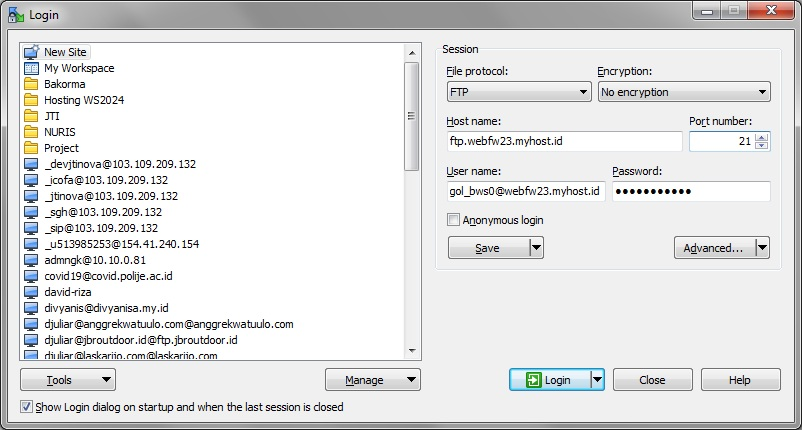
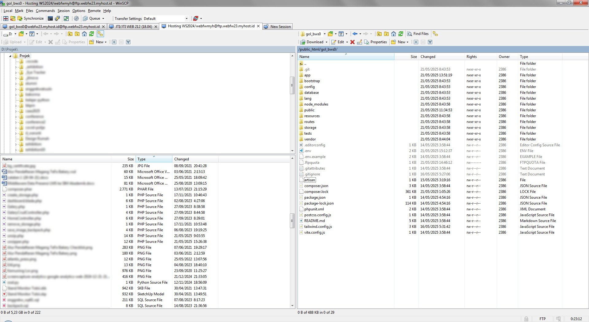
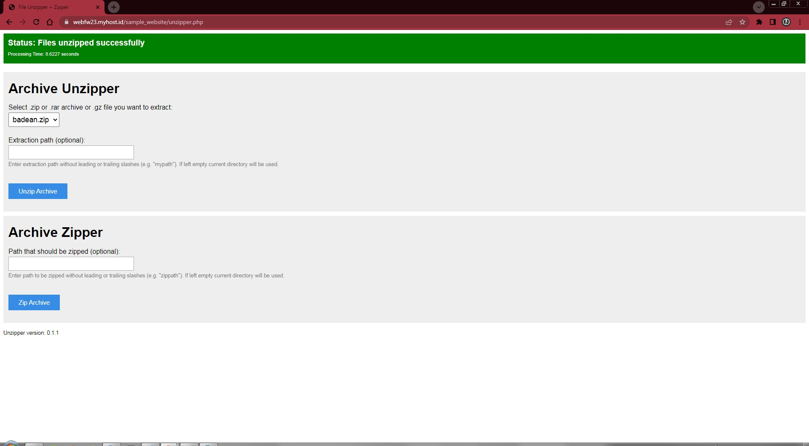
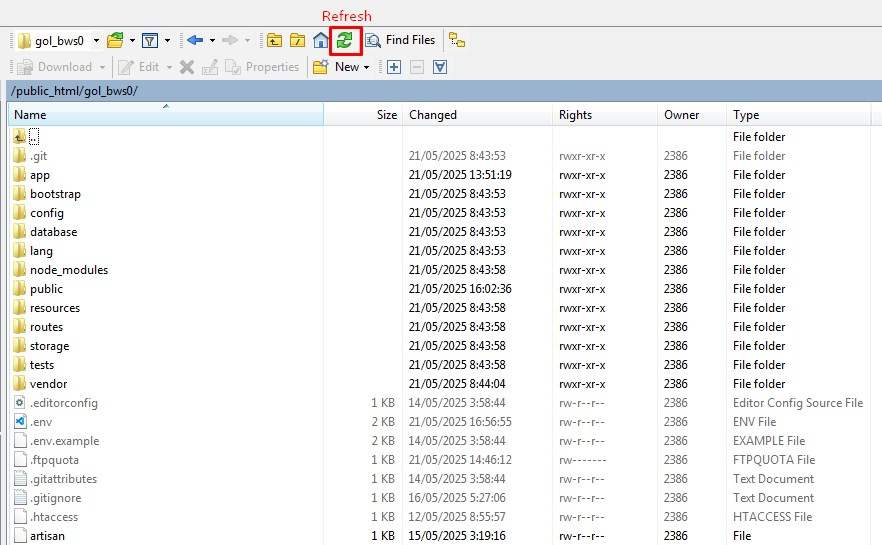

| Pokok Bahasan | Deployment Laravel ke Server Hosting    |
| ------------: | :-------------------------------------- |
| Praktikum     | Workshop Sistem Informasi Web Framework |
| Pengampu 	    | David Juli Ariyadi, S.Kom., M.Kom.      |
| Minggu Ke-    | 14                                      |

# Deployment Laravel ke Server Hosting

## A. Cara Deployment Awal
1. Silahkan buka WinSCP, yang belum punya silahkan diinstall dahulu di [https://winscp.net/eng/download.php](https://winscp.net/eng/download.php)
2. Masuk ke FTP dengan pengaturan yang telah di berikan sesuai dengan Golongan dan Kelompok masing-masing, contoh pengaturannya sebagai berikut:
```ini
# Golongan BWS Kelompok 0 (Project Manager)
WEB_URL = webfw23.myhost.id/gol_bws0
HOSTNAME = ftp.webfw23.myhost.id
PORT = 21
USERNAME = gol_bws0@webfw23.myhost.id
PASSWORD = xxxxxxxx
```


3. Copas seluruh file project laravel ke folder root /.



atau 

4. Semua file laravel di archive dahulu dengan ekstensi zip.

5. Gunakan library [Unzipper](https://github.com/ndeet/unzipper) dari (https://github.com/ndeet/unzipper) untuk mengekstrak file zip projek laravel.



lakukan refresh di winscp, maka file di dalam zip sudah terekstrak ke folder root.



6. Lakukan setting file `.env`, berikut yang harus di ubah:
```ini
#Koneksi Database
DB_CONNECTION=mysql
DB_HOST=127.0.0.1
DB_PORT=3306
DB_DATABASE=webfwmyh_gol_bws0
DB_USERNAME=webfwmyh_gol_bws
DB_PASSWORD=xxxxxxxx

# awalnya `local`, ini yang akan mempengaruhi file upload akan menuju private atau public
FILESYSTEM_DISK=public
```
7. Lakukan Storage Link untuk menyambungkan folder `storage` ke `public`
```bash
php artisan storage:link
```

## B. Cara Pertama (Memindahkan `index.php` di dalam folder public)
1. Buka folder public dan copy file `index.php` dan `.htaccess` ke root folder.
2. Buka file `index.php` yang di root folder kemudian hapus bagian `../` agar direktori `storage`,`vendor` dan `bootstrap` terkoneksi dengan benar.
3. Buka file `.env` lalu tambahkan pengaturan berikut agar css, javascript dan gambar bisa terkoneksi.
```ini
# Set ini sesuai folder kelompok
APP_URL=https://webfw23.myhost.id/gol_bws0

ASSET_URL="${APP_URL}/public"
```
4. Jika css, javascript dan gambar tidak terkoneksi, maka tambahkan function `asset()` pada setiap sourcenya, misalkan:
```php

```
> Dalam kasus tertentu cara ini bisa berbahaya bagi keamanan password di `.env` karena kita bisa membuka secara langsung dari url, maka pastikan cek dengan membuka file `.env` di browser, pastikan sudah tidak bisa diakses. Jika masih bisa diakses tambahkan script berikut di `.htaccess`.
```sh
# Disable index view
Options -Indexes

# Hide a specific file
<Files .env>
    Order allow,deny
    Deny from all
</Files>
```

## C. Cara Kedua (Metode menambahkan `.htaccess`)
1. Buatkan folder baru di root misalkan `laravel` (Opsional), kemudian masukkan file project laravel ke folder tersebut.
2. buat file .htaccess lalu isi dengan script berikut :
```sh
<IfModule mod_rewrite.c>
	RewriteEngine On
	RewriteRule ^()($|/) - [L] # Exclude Folder
	RewriteRule ^(.*)$ laravel/public/$1 [L]
</IfModule>
```
> Cara ini berlaku jika menggunakan server fisik seperti server ubuntu dsb.