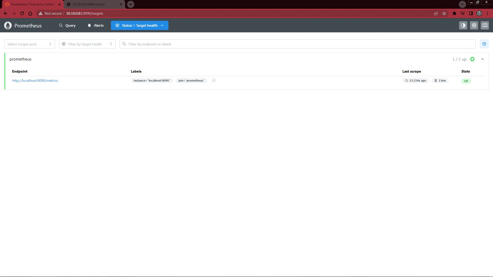
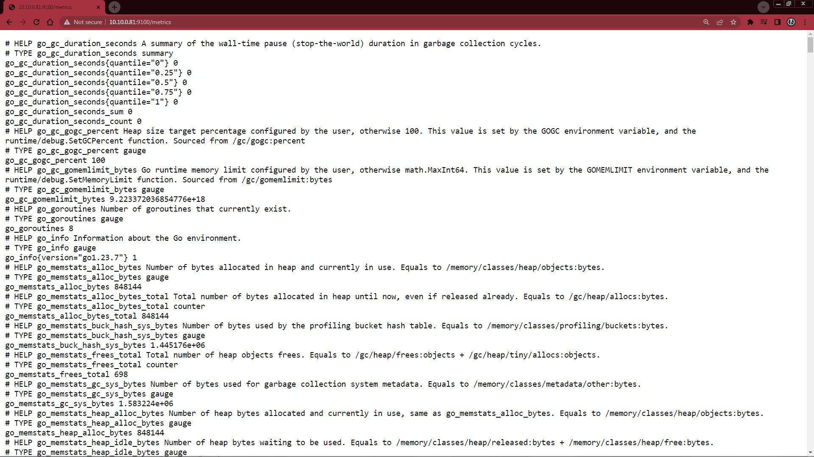

# A. Tahapan Instalasi Prometheus

## 1. Download Prometheus

```bash
wget https://github.com/prometheus/prometheus/releases/download/v3.4.0-rc.0/prometheus-3.4.0-rc.0.linux-amd64.tar.gz
ls -l
```

## 2. Extraksi File Prometheus

```bash
tar xvf prometheus-3.4.0-rc.0.linux-amd64.tar.gz
ls -l
```

## 3. Memindah File Binari Prometheus untuk Bisa Mengakses Command Secara Langsung

```bash
cd prometheus-3.4.0-rc.0.linux-amd64
ls -l
sudo mv prometheus promtool /usr/local/bin/
which prometheus
which promtool
```

cek version prometheus

```bash
prometheus --version
```

```bash
prometheus, version 3.4.0-rc.0 (branch: HEAD, revision: 7a92230652a83f1b745f2d0a586037e4428b15e9)
  build user:       root@cb8653a018d8
  build date:       20250502-17:30:47
  go version:       go1.24.2
  platform:         linux/amd64
  tags:             netgo,builtinassets,stringlabels
```

## 4. Buatkan Grup User dan User untuk Prometheus

```bash
sudo groupadd --system prometheus
sudo useradd --system -s /sbin/nologin -g prometheus prometheus
```

## 5. Membuat Folder Tempat File Konfigurasi prometheus.yml dan Data Prometheus ke Folder Tersendiri

```bash
sudo mkdir /etc/prometheus
sudo mkdir /var/lib/prometheus

chown -R prometheus:prometheus /var/lib/prometheus/
ls -l /var/lib/

sudo mv prometheus.yml /etc/prometheus/
cd /etc/prometheus
ls -l
```

## 6. Melakukan Penyesuaian File Konfigurasi prometheus.yml

```bash
sudo nano prometheus.yml
```

Ubah menjadi :

```yaml
global:
  scrape_interval: 15s
  evaluation_interval: 15s

scrape_configs:
  - job_name: "prometheus"
    static_configs:
      - targets: ["localhost:9090"]
```

## 7. Buatkan Service Agar Prometheus Bisa Berjalan di Background

```bash
sudo nano /etc/systemd/system/prometheus.service
```

isi dengan script berikut:

```ini
[Unit]
Description=Prometheus
Documentation=https://prometheus.io/docs/introduction/overview/
Wants=network-online.target
After=network-online.target

[Service]
User=prometheus
Group=prometheus
Type=simple
ExecStart=/usr/local/bin/prometheus --config.file=/etc/prometheus/prometheus.yml --storage.tsdb.path /var/lib/prometheus/

[Install]
WantedBy=multi-user.target
```

reload `daemon service`:

```bash
sudo systemctl daemon-reload
```

start dan cek status prometheus:

```bash
sudo systemctl start prometheus
sudo systemctl status prometheus
```

Enable Auto-Start Prometheus

```bash
sudo systemctl enable --now prometheus
```

maka autostart prometheus sudah `enable`

```bash
● prometheus.service - Prometheus
     Loaded: loaded (/etc/systemd/system/prometheus.service; enabled; preset: enabled)
     Active: active (running) since Wed 2025-05-14 04:26:12 UTC; 4min 45s ago
       Docs: https://prometheus.io/docs/introduction/overview/
   Main PID: 352708 (prometheus)
      Tasks: 6 (limit: 2272)
     Memory: 25.2M (peak: 25.5M)
        CPU: 441ms
     CGroup: /system.slice/prometheus.service
             └─352708 /usr/local/bin/prometheus --config.file=/etc/prometheus/prometheus.yml --storage.tsdb.path /var/lib/prometheus/
```

secara default prometheus berjalan di port `9090` silahkan bisa dicek dengan cara

```bash
sudo lsof -n -i | grep prometheus
```

```bash
prometheu 352708      prometheus    6u  IPv6 1926790      0t0  TCP *:9090 (LISTEN)
prometheu 352708      prometheus   10u  IPv4 1926839      0t0  TCP 127.0.0.1:52742->127.0.0.1:9090 (ESTABLISHED)
prometheu 352708      prometheus   11u  IPv6 1926840      0t0  TCP 127.0.0.1:9090->127.0.0.1:52742 (ESTABLISHED)
```

cek ip hostname untuk menjalankan prometheus di browser:

```bash
hostname -I
```

## 8. Prometheus Telah Aktif Berjalan di Port `9090`

- Tampilan Prometheus setelah dijalankan di http://127.0.0.1:9090/ dengan PromQL (Prometheus Query Language) perintah `prometheus_build_info`




- Contoh Bentuk Data Time Series yang Diproses Prometheus


pada tahap ini kita masih belum bisa melakukan query terhadap metrik-metrik yang berhubungan dengan Komponen server seperti CPU, Disk, Memory dan sebagainya.

# B. Instalasi Node Exporter

Node Exporter adalah sebuah agent (exporter) yang berjalan di server untuk mengumpulkan metrik sistem operasi seperti:

- CPU usage
- Memory (RAM)
- Disk usage & I/O
- Network traffic
- Filesystem stats
- Load average
- Uptime, dan lainnya

> Node Exporter adalah salah satu exporter paling penting dalam ekosistem Prometheus, digunakan untuk memonitor infrastruktur server secara menyeluruh.

## 1. Download Prometheus dan Node Exporter

```bash
wget https://github.com/prometheus/node_exporter/releases/download/v1.9.1/node_exporter-1.9.1.linux-amd64.tar.gz
ls -l
```

## 2. Extraksi File Prometheus dan Node Exporter

```bash
tar xvf node_exporter-1.9.1.linux-amd64.tar.gz
ls -l
```

## 3. Memindah File Binari Prometheus untuk Bisa Mengakses Command Secara Langsung

```bash
cd node_exporter-1.9.1.linux-amd64
ls -l
sudo mv node_exporter /usr/local/bin/
which node_exporter
```

cek version node_exporter

```bash
node_exporter --version
```

```bash
node_exporter, version 1.9.1 (branch: HEAD, revision: f2ec547b49af53815038a50265aa2adcd1275959)
  build user:       root@7023beaa563a
  build date:       20250401-15:19:01
  go version:       go1.23.7
  platform:         linux/amd64
  tags:             unknown
```

## 4. Buatkan Service Agar Node Exporter Bisa Berjalan di Background

```bash
sudo nano /etc/systemd/system/node_exporter.service
```

isi dengan script berikut:

```ini
[Unit]
Description=Prometheus exporter for machine metrics

[Service]
Restart=always
User=prometheus
ExecStart=/usr/local/bin/node_exporter
ExecReload=/bin/kill -HUP $MAINPID
TimeoutStopSec=20s
SendSIGKILL=no

[Install]
WantedBy=multi-user.target
```

reload `daemon service`:

```bash
sudo systemctl daemon-reload
```

start dan cek status node_exporter:

```bash
sudo systemctl start node_exporter
sudo systemctl status node_exporter
```

Enable Auto-Start Node Exporter

```bash
sudo systemctl enable --now node_exporter
```

maka autostart node_exporter sudah `enable`

```bash
● node_exporter.service - Prometheus exporter for machine metrics
     Loaded: loaded (/etc/systemd/system/node_exporter.service; enabled; preset: enabled)
     Active: active (running) since Wed 2025-05-14 05:46:38 UTC; 39s ago
   Main PID: 353170 (node_exporter)
      Tasks: 3 (limit: 2272)
     Memory: 2.0M (peak: 2.2M)
        CPU: 21ms
     CGroup: /system.slice/node_exporter.service
             └─353170 /usr/local/bin/node_exporter
```

secara default node_exporter berjalan di port `9100` silahkan bisa dicek dengan cara

```bash
sudo lsof -n -i | grep node
```

```bash
node_expo 353170      prometheus    3u  IPv6 1930329      0t0  TCP *:9100 (LISTEN)
```

cek ip hostname untuk menjalankan node_exporter di browser:

```bash
hostname -I
```

## 5. Node Exporter Telah Aktif Berjalan di Port `9100`

- Tampilan Node Exporter setelah dijalankan di http://127.0.0.1:9100/


- Contoh Bentuk Data Time Series yang Diproses Node Exporter di http://10.10.0.81:9100/metrics



## 6. Menyambungkan Node Exporter ke Prometheus

Tambahkan syntax berikut di file kondifurasi `/etc/prometheus/prometheus.yml`

```yml
- job_name: "node-exporter"
  static_configs:
    - targets: ["localhost:9100"]
```

restart dan cek status prometheus:

```bash
sudo systemctl restart prometheus
sudo systemctl status prometheus
```

Tampilan prometheus setelah ditambahkan:


# C. Grafana sebagai Visualisasi & Monitoring

Grafana adalah platform visualisasi dan analisis data yang bisa terhubung ke berbagai sumber data seperti Prometheus, InfluxDB, Elasticsearch, MySQL, PostgreSQL, dll.

## 1. Fungsi Utama Grafana:

- Membuat dashboard interaktif dan real-time berdasarkan data metrik.
- Menyediakan panel-panel visual (grafik, tabel, heatmap, gauge, dll).
- Bisa digunakan untuk monitoring sistem, aplikasi, database, jaringan, dll.
- Dapat digunakan untuk membuat alert berbasis visualisasi metrik.
- Mendukung authentication & role-based access control (RBAC).

## 2. Integrasi Prometheus dan Grafana:

- Prometheus sebagai data source di Grafana.
- Di Grafana, kita buat dashboard dengan panel-panel yang menampilkan data dari Prometheus.
- Bisa memanfaatkan PromQL langsung dalam query di Grafana.
- Visualisasi akan diperbarui real-time sesuai interval yang ditentukan.

## 3. Instalasi Grafana

- Install prasyarat packages:

```bash
sudo apt-get install -y apt-transport-https software-properties-common wget
```

- Import GPG key:

```bash
sudo mkdir -p /etc/apt/keyrings/
wget -q -O - https://apt.grafana.com/gpg.key | gpg --dearmor | sudo tee /etc/apt/keyrings/grafana.gpg > /dev/null
```

- Tambahkan repository, pakai yang stable releases:

```bash
echo "deb [signed-by=/etc/apt/keyrings/grafana.gpg] https://apt.grafana.com stable main" | sudo tee -a /etc/apt/sources.list.d/grafana.list
```

- Jalankan perintan berikut untuk update daftar package yang tersedia:

```bash
# Updates the list of available packages
sudo apt-get update
```

- Install Grafana OSS, jalankan perintah berikut:

```bash
# Installs the latest OSS release:
sudo apt-get install grafana
```

Cek status Grafana apakah sudah berjalan:

```bash
sudo systemctl start grafana-server.service
sudo systemctl status grafana-server.service
```

Enable Auto-Start Grafana

```bash
sudo systemctl enable --now grafana-server.service
```

maka autostart grafana sudah `enable`

```bash
● grafana-server.service - Grafana instance
     Loaded: loaded (/usr/lib/systemd/system/grafana-server.service; enabled; preset: enabled)
     Active: active (running) since Wed 2025-05-14 07:14:44 UTC; 3min 10s ago
       Docs: http://docs.grafana.org
   Main PID: 355111 (grafana)
      Tasks: 16 (limit: 2272)
     Memory: 174.2M (peak: 174.4M)
        CPU: 7.936s
     CGroup: /system.slice/grafana-server.service
             └─355111 /usr/share/grafana/bin/grafana server --config=/etc/grafana/grafana.ini --pidfile=/run/grafana/grafana-server.pid --packaging=deb cfg:default.paths.logs=/var/log/grafana cfg:default.paths.data=/var/lib/grafana cfg:default.paths.plugins=/var/lib/grafana/plugins cfg:default.paths.provisioning=/etc/grafana/provisioning
```

## 2. Grafana Telah Aktif Berjalan di Port `3000`

```bash
sudo lsof -n -P -i | grep grafana
```

```bash
grafana   355111         grafana    7u  IPv6 1944467      0t0  TCP 10.10.0.81:3000->10.10.2.168:59986 (ESTABLISHED)
grafana   355111         grafana    8u  IPv6 1944664      0t0  TCP 10.10.0.81:3000->10.10.2.168:60055 (ESTABLISHED)
grafana   355111         grafana   11u  IPv6 1943494      0t0  TCP *:3000 (LISTEN)
```

- Tampilan Login Grafana setelah dijalankan di http://127.0.0.1:3000/login
- Masukkan username : **admin** | password : **admin**


- Tampilan update password default Grafana setelah login


- Tampilan dashboard awal Grafana setelah login


- Pada bagian **Home** > **Connections** > **Data sources** klik tombol `Add data source`


- Pilih atau cari `Prometheus`


- Masukkan alamat prometheus yang akan kita ambil datanya seperti http://10.10.0.81:9090/


- Scroll ke Bawah tekan tombol `Save & Test` untuk menyimpan dan akan dapat notifikasi <em>**Successfully queried the Prometheus API**</em> jika sukses tersambung ke Prometheus


## 3. Membuat Custom Dashboard Monitoring

- Pilih tanda [+] > **New Dashboard**


- Tekan tombol `New Visualization`


- Pilih Data Source `Prometheus`


- Pada Pilihan **Builde** dan **Code**, Pilih `Code`


- Sebagai contoh, masukkan pada Metrics Browser inputan `PromQL query` seperti `node_memory_MemTotal_bytes` > Tekan tombol `Run queries`


- Setelah mendapatkan nilai ubah jenis Visualizationnya menjadi `Stat`
- Ubah Title `Memory Used`
- Pada Opsi `Standart options` > Unit `Data` > bytes (SI) > tekan `Save dashboard` jika selesai


hasil yang ditampilkan


- Jika ingin menggunakan template dashboard yang sudah jadi seperti di link berikut https://grafana.com/grafana/dashboards/1860-node-exporter-full/


- Tekan tombol **Copy ID to Clipboard** atau **Download JSON** > Buka Grafana Server > **Pilih [+]** > **Import Dashboard**


Jika ID template tersedia maka akan diarahkan pada halaman berikut lalu tekan tombol **Import**:


- Berikut hasil Template Node Exporter Full yang disediakan di Grafana.com


# D. Kesimpulan

Hasil percobaan Instalasi Prometheus, Node Exporter yang terintegrasi dengan Grafana Visualization sudah Berhasil, Silahkan bagi mahasiswa dapat lebih di eksplorasi lagi untuk hasil visualisasi yang lebih informatif lagi seperti penambahan fitur **Alert** pada sistem grafana.
